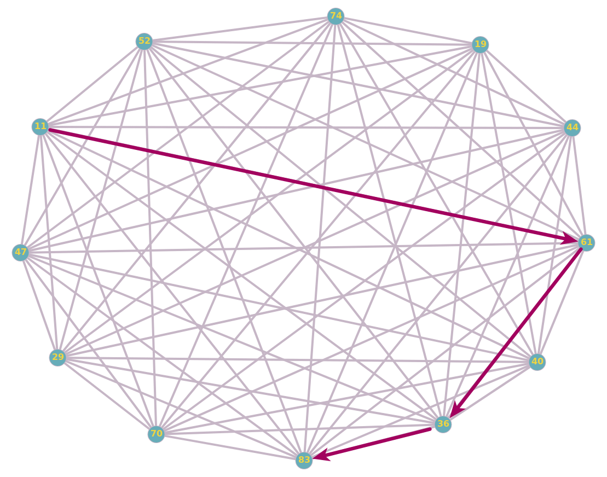

# Solving of the "factor" problem with a DFS on a K12 graph

## Reader's background (Yep, I mean you :) )

* Graph theory
* Depth First Search (DFS)
* C++

__```If you wann learn about graphs, please see my write up:``` [graph theory](../../../../Graph-theory)__

## The K12-graph


## Constraint
For each vertex _v_ in V, check all reachable vertices _i_, such _i_ has at leaést one digit of _v_.

For example, {11, 61, 36, 83} is a path.



## Create the input

First I create a [Python script](edges.py) to generate the input for our program.

Generated input: [input](input) 

This script will generate the file 'input' which will contains the input in this format:
  
```
line #1: two space seperated integers _12_ and _66_. _12_ is the number of vertices and _66_ the number of edges.
  
for the 66th next lines, we have two space seperated intgers in each line, which indicates the edge.
```
  
  
 ## Coding
 
 Coding a C++ program that for each vertex _v_ in the K12 graph, detect all reachable vertices that respect the constraint.
 
 __(Recall: the constraint is: _P = <v0 v1 v2 ... vn>_ is a accepeted path, iif _vi_ has at least one digit of _vi-1_, such _0 < i <= n_)__
 
 C++ Code: [C++ Program](facteur.cpp)
 
 The output: [output](output)
